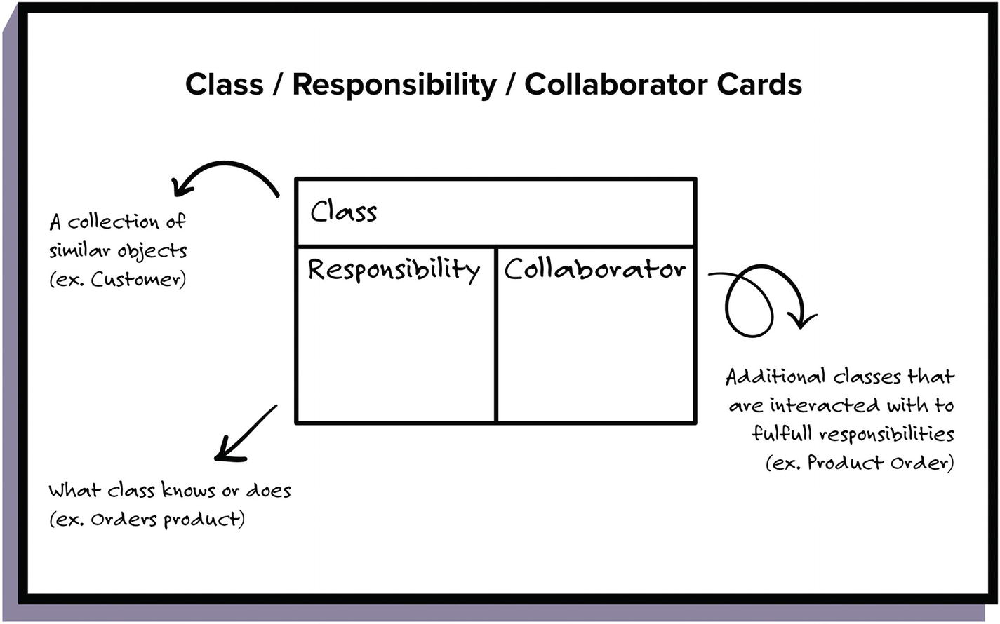

# CRC Cards - Advocates

Class Responsibility Collaborator Cards or just CRC Cards are a technic to visualize explicit the abstraction of an system. This allow to clarify, expose and dialog with stackeholders and provide an good way to design the UML diagrams to blueprint the system for the implementation. 

Is just a small card split in three spaces:

**First:** On top will identify the name of a collection of similar objects, in the future a class name. 

**Second:** At the left the responsibilities, what class knows or does. Just the abstraction of what this class do in the system, in the future is the attributes and behaviors of an class . 

**Third:** At the right the collaborators, additional classes that are interacted with to fulfill responsibilities. Just a list of others CRC that this one communicate with, in the future clarify the interface set of classes.

With an set of CRC Cards on board is simple to test and retest a lot system flux and modify how many times is needed, because is cheap, is visual, is comfortable for everyone. And, one time finished is simple to translate in an UML Class diagram. 

It is occurs because the CRC can be dismembered in very small components, like functions, classes and others collections of components. 



# My examples of CRC Cards

CRC: User
```
Responsabilities
- Input login/senha
- Submit formulário
- Submit forgot password/login
- Submit Register
```

```
Collaborators:
- System auth
```
CRC: System auth
```
Responsabilities
- Authenticate user
- Submit success + token
- Submit fail 
- Call system webpage
- Submit webpage Register 
```

```
Collaborators:
- User
- System
```
CRC: System
```
Responsabilities
- Submit webpage components
```

```
Collaborators:
- System
- User
```