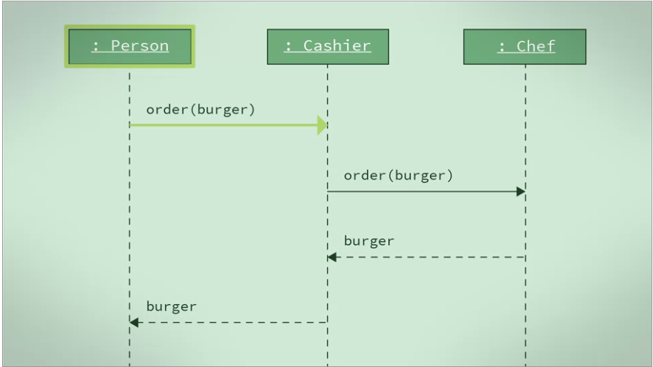
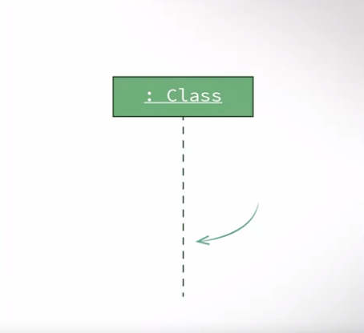
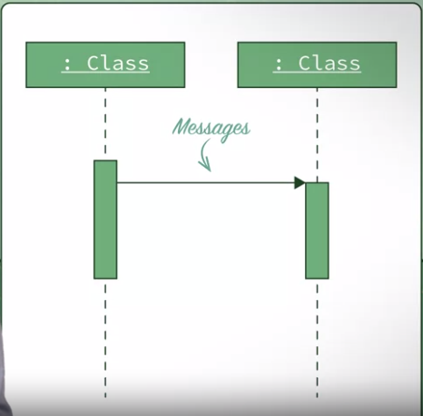
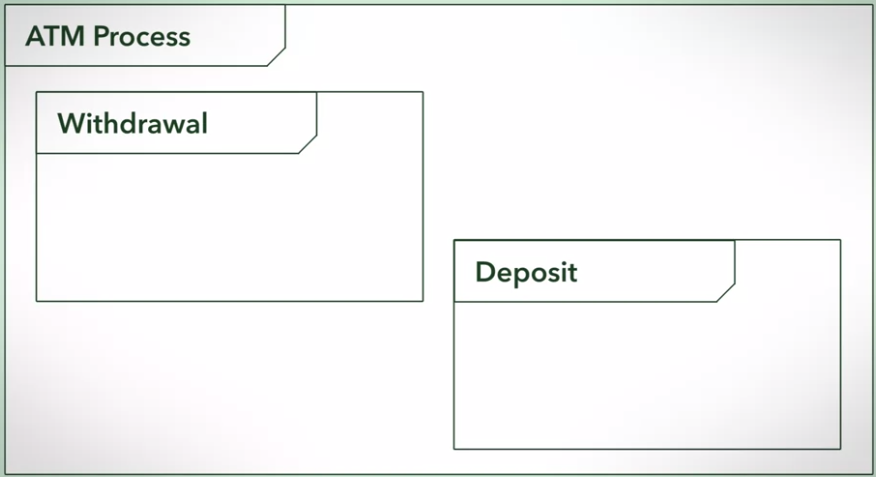
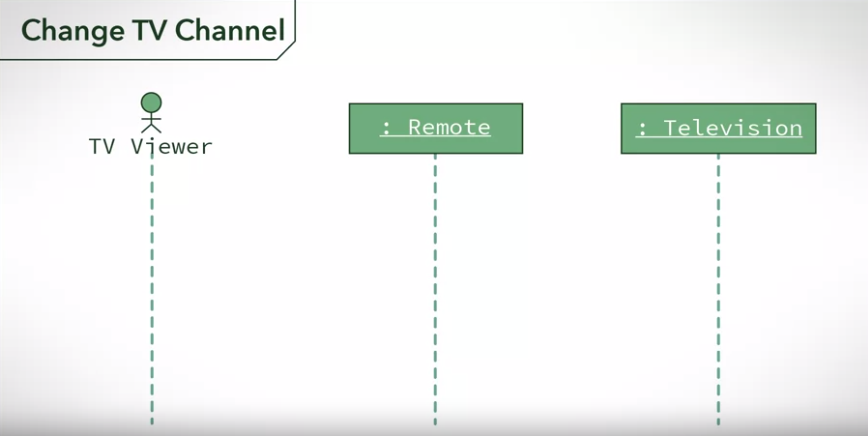
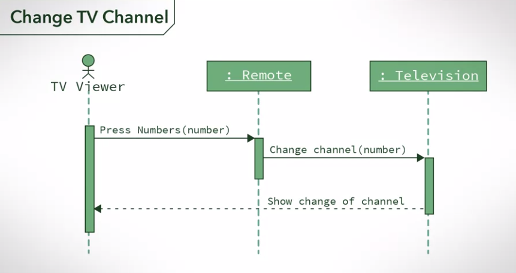
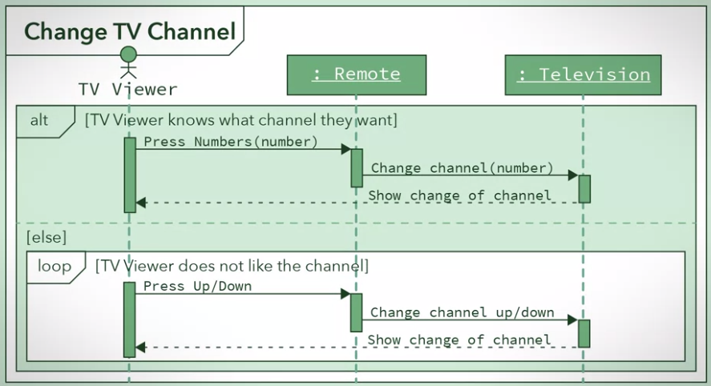

# UML_Sequence_Diagram | Modelling Behaviour

A sequence diagram describes how objects in your system interact to complete a specific task.  When creating sequence diagrams, first you use a box to represent role play by an object. The role is typically labeled by the name of the class for the object. Second, you use vertical dotted lines, known as lifelines, to represent an object as time passes by. Finally, you use arrows to show messages that are sent from one object to another.

A sequence diagram can contain other sequence diagrams within it. For example, if you are creating a sequence diagram for an ATM, there might be a different sequence for Withdrawal and Deposits. And during a single process someone might want to do both. In your sequence diagram, you would have one big sequence of activities with two smaller sequences inside them. Moving on, in the top corner I'm going to draw a label with a meaningful title.

Each of these objects has a lifeline. The lifelines you can draw as a dashed line projecting downwards from the object. 

In a sequence diagram, if one object sends a message to another object or objects, we denote this by drawing a solid line arrow from the sender to the receiver. To return data and to control back to initiating objects, we would use a dotted line arrow. 

You can also show loops and alternative processes in a sequence diagram. put the sequence in a box and label it. And label another bellow has *else* for explicit the looping.

